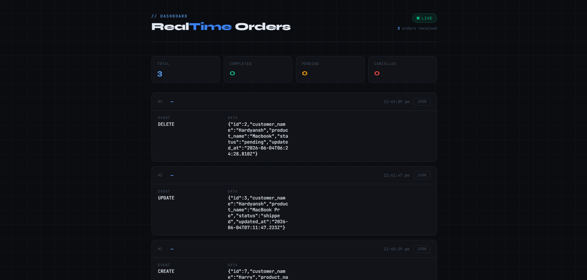

# Apt Backend Assignment - Hardyansh Sharma (IIIT Ranchi)

## Overview

This project implements a real-time order monitoring system where connected clients automatically receive updates whenever an order is created, updated, or deleted.

The solution follows an event-driven architecture using RabbitMQ and Socket.IO to eliminate client-side polling and provide instant updates to all connected clients.

### Workflow

1. A client sends a request to create, update, or delete an order.
2. The API persists the change in PostgreSQL.
3. The API publishes an event to RabbitMQ.
4. A consumer receives the event from RabbitMQ.
5. The consumer broadcasts the update through Socket.IO.
6. Connected clients receive the update instantly without refreshing the page.

---

## Tech Stack

* Node.js
* Express.js
* PostgreSQL
* RabbitMQ
* Socket.IO
* Docker

---

## Project Structure

```text
src/
│
├── server.js
│
├── config/
│   ├── db.js
│   └── rabbitmq.js
│
├── routes/
│   └── orderRoutes.js
│
├── controllers/
│   └── orderController.js
│
├── services/
│   └── orderPublisher.js
│
├── consumers/
│   └── orderConsumer.js
│
└── public/
    └── index.html
```

---

## Prerequisites

* Node.js
* PostgreSQL
* Docker Desktop

---

## Database Setup

Create the database:

```sql
CREATE DATABASE apt_assignment;
```

Create the orders table:

```sql
CREATE TABLE orders (
    id SERIAL PRIMARY KEY,
    customer_name VARCHAR(255),
    product_name VARCHAR(255),
    status VARCHAR(50),
    updated_at TIMESTAMP DEFAULT CURRENT_TIMESTAMP
);
```

Insert sample data (optional):

```sql
INSERT INTO orders (
    customer_name,
    product_name,
    status
)
VALUES (
    'Hardyansh',
    'Laptop',
    'pending'
);
```

---

## Environment Variables

Create a `.env` file in the project root.

```env
PORT=5000

DB_HOST=localhost
DB_PORT=5432
DB_USER=postgres
DB_PASSWORD=YOUR_POSTGRES_PASSWORD
DB_NAME=apt_assignment

RABBITMQ_URL=amqp://localhost
```

---

## RabbitMQ Setup

Start RabbitMQ using Docker:

```bash
docker run -d --name rabbitmq -p 5672:5672 -p 15672:15672 rabbitmq:3-management
```

RabbitMQ Management Dashboard:

```text
http://localhost:15672
```

Default Credentials:

```text
Username: guest
Password: guest
```

---

## Installation

Install dependencies:

```bash
npm install
```

---

## Running the Application

Start the backend server:

```bash
npm start
```

Application URL:

```text
http://localhost:5000
```

---

## API Endpoints

### Create Order

```http
POST /orders
```

Request Body:

```json
{
  "customer_name": "Harry",
  "product_name": "iPhone 17",
  "status": "pending"
}
```

---

### Update Order

```http
PUT /orders/:id
```

Request Body:

```json
{
  "status": "shipped"
}
```

---

### Delete Order

```http
DELETE /orders/:id
```

---

## Real-Time Updates

Open the dashboard:

```text
http://localhost:5000
```

Any CREATE, UPDATE, or DELETE operation will be pushed instantly to all connected clients through Socket.IO.

No polling or page refresh is required.

---

## Architecture

```text
                ┌─────────────────┐
                │ Browser Client  │
                └────────▲────────┘
                         │
                    Socket.IO
                         │
                         ▼
                ┌─────────────────┐
                │    Consumer     │
                └────────▲────────┘
                         │
                         ▼
                ┌─────────────────┐
                │ RabbitMQ Queue  │
                └────────▲────────┘
                         │
                         ▼
                ┌─────────────────┐
                │RabbitMQ Exchange│
                └────────▲────────┘
                         │
                         ▼
                ┌─────────────────┐
                │   Express API   │
                └───────┬─────────┘
                        │
                        ▼
                ┌─────────────────┐
                │   PostgreSQL    │
                └─────────────────┘
```

---

## Design Decisions

RabbitMQ is used between the API layer and the notification layer to decouple order processing from client notifications.

Instead of directly pushing updates to connected clients, database changes are first published as events to RabbitMQ. Consumers process these events and broadcast them using Socket.IO.

This architecture provides:

* Scalability
* Reliability
* Maintainability
* Separation of concerns

Producers and consumers can be scaled independently without affecting the client-facing layer.

---

## Scalability Considerations

* RabbitMQ decouples database operations from client notifications.
* Multiple consumers can be added to process events in parallel.
* Socket.IO servers can be horizontally scaled using adapters such as Redis.
* Event-driven communication avoids expensive client polling.
* Producers and consumers can evolve independently without affecting each other.

For larger deployments, Change Data Capture (CDC) solutions such as Debezium can be integrated to capture database changes regardless of the source of the update.

---

## Assumptions and Trade-offs

This implementation publishes events from the application layer after successful database writes.

As a result, changes made directly in the database outside the application will not generate notifications.

In a production environment, this limitation can be addressed using Change Data Capture (CDC) tools such as Debezium or database-native event streaming mechanisms.

---

## Features

* Real-time order updates
* Event-driven architecture
* RabbitMQ message queue integration
* PostgreSQL persistence
* Socket.IO client notifications
* Browser-based monitoring dashboard
* Dockerized RabbitMQ setup
* Support for CREATE, UPDATE, and DELETE order events

## Assignment Output



---

## Future Improvements

* Change Data Capture (CDC) using Debezium
* Authentication and authorization
* Redis adapter for Socket.IO clustering
* Retry mechanisms and dead-letter queues
* Event persistence and replay support

---

## Author

**Hardyansh Sharma**
Backend Engineer ( IIIT RANCHI )
